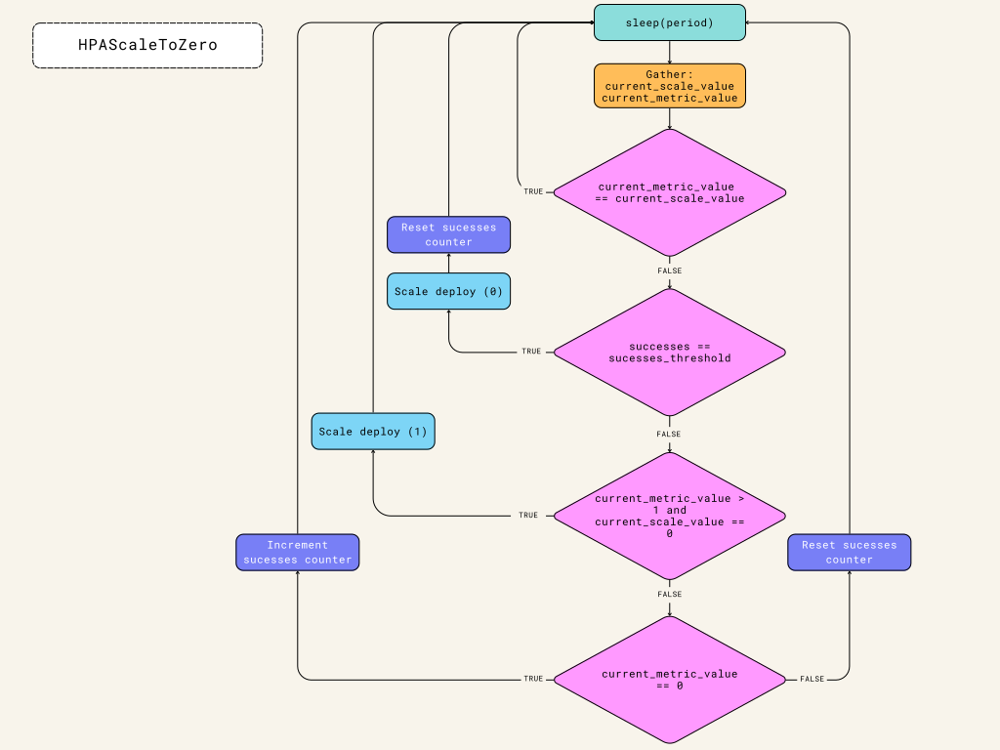

# K8-HPAScaleToZero

Currently the out of the box Kubernetes horizontal pod autoscaler (HPA) does not scale to zero.

This project is intended to emulate the [HPAScaleToZero](https://kubernetes.io/docs/reference/command-line-tools-reference/feature-gates/) Kubernetes feature gate which is currently still in alpha.
The idea is this is deployed into a Kubernetes namespace along side a deployment that is scaled via a horizontal pod autoscaler.

## Logic flow


## Prerequisites

Some cluster role and binding are required otherwise there are no permissions to read metrics or adjust deployments.

### ClusterRoleBinding
```yaml
apiVersion: rbac.authorization.k8s.io/v1
kind: ClusterRoleBinding
metadata:
  labels:
    app.kubernetes.io/name: hpa-scale-to-zero
  name: hpa-scale-to-zero
roleRef:
  apiGroup: rbac.authorization.k8s.io
  kind: ClusterRole
  name: hpa-scale-to-zero
subjects:
- kind: ServiceAccount
  name: <A SERVICE ACCOUNT TO USE>
  namespace: <THE NAMESPACE>
```

### ClusterRole
```yaml
apiVersion: rbac.authorization.k8s.io/v1
kind: ClusterRole
metadata:
  labels:
    app.kubernetes.io/name: hpa-scale-to-zero
  name: hpa-scale-to-zero
rules:
- apiGroups:
  - autoscaling
  resources:
  - horizontalpodautoscalers
  verbs:
  - list
  - get
  - watch
- apiGroups:
  - apps
  resources:
  - deployments/scale
  verbs:
  - list
  - get
  - watch
  - patch
- apiGroups:
  - custom.metrics.k8s.io
  resources:
  - '*'
  verbs:
  - get
```

## Example K8 deployment

```yaml
apiVersion: apps/v1
kind: Deployment
metadata:
  labels:
    app.kubernetes.io/component: hpa-scale-to-zero
  name: hpa-scale-to-zero
  namespace: <THE NAMESPACE>
spec:
  replicas: 1
  selector:
    matchLabels:
      app.kubernetes.io/component: hpa-scale-to-zero
  template:
    metadata:
      labels:
        app.kubernetes.io/component: hpa-scale-to-zero
    spec:
      containers:
      - args:
        - --namespace
        - <THE NAMESPACE>
        - --hpa
        - <THE HPA NAME>
        - --metric-name
        - prometheus.googleapis.com|resque_jobs_in_queue|gauge
        - --period
        - "5"
        - --deployment
        - <THE TARGET DEPLOYMENT>
        - --success-threshold
        - "100"
        - -v
        - debug
        image: hpa-scale-to-zero:1
        imagePullPolicy: Always
        name: hpa-scale-to-zero
        resources:
          limits:
            cpu: 200m
            memory: 256Mi
          requests:
            cpu: 200m
            memory: 256Mi
```

## Local dev

### Install
Install the package in `edit` mode.  This allows you to change the code without re-installing each time.

```bash
cd K8-HPAScaleToZero
pip install -e .
```

The code checks if it is being run from outside or inside a k8 cluster and loads the appropriate k8 config.
This makes running locally pretty easy.

```python
if os.getenv('KUBERNETES_SERVICE_HOST'):
		self.logger.info("Using in cluster config")
		config.load_incluster_config()
else:
		self.logger.info("Not in cluster - Loading kube config")
		config.load_kube_config()
```

### Running
```bash
zero-scale -n <THE NAMESPACE> -h <THE HPA NAME> -m "prometheus.googleapis.com|resque_jobs_in_queue|gauge" -v debug -p 2 -d <DEPLOYMENT NAME>
```


## Building docker image:
```
docker build -t hpa-scale-to-zero:1 .
```
